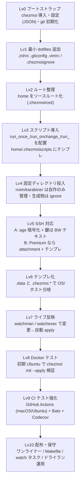

# dotfiles
## Set up guide before `chezmoi init --apply`
### MacOS
```sh
export HOMEBREW_NO_INSTALL_FROM_API=1
/bin/bash -c "$(curl -fsSL https://raw.githubusercontent.com/Homebrew/install/HEAD/install.sh)"
brew install git chezmoi
```
### Ubuntu
```sh
sudo apt update && sudo apt install -y git
snap install chezmoi --classic
```
### Windows
```ps1
winget install --id Git.Git -e --source winget
winget install --id=twpayne.chezmoi  -e
```

## Chezmoi init
```sh
chezmoi init --apply hibiki-kato/dotfiles
```

## TODO


# Bellow are deprecated instructions. 
## MacOS

### Install command line tools
Install command line tools for Xcode. This is required for installing git and other packages.
```sh
xcode-select --install
```
Set user name and email for git. 
```sh
git config --global user.name "Your Name"
git config --global user.email "example.com"
```

## Clone this repository
```sh
cd ~
git clone https://github.com/hibiki-kato/dotfiles.git
cd dotfiles
```

## Run startup.sh
```sh
zsh ./scripts/setup.sh
```

## System settings
Open settings and set as same as previous device.

Additionally, run
```sh
zsh ./scripts/system_settings.sh
``` 

## Raycast
Open System Settings > General > Keyboard > Keyboard Shortcuts > Spotlight >

## Music
Set equalizer

## Zotero
Install Zotmoov, Better BibTeX, and Zotero Better Notes.

Follow this [link](https://plaza.umin.ac.jp/shoei05/index.php/2025/01/03/2706/#2_クラウドストレージにはメタ情報のみ、pdfは外部ストレージへ設定する_Zotmoov)


