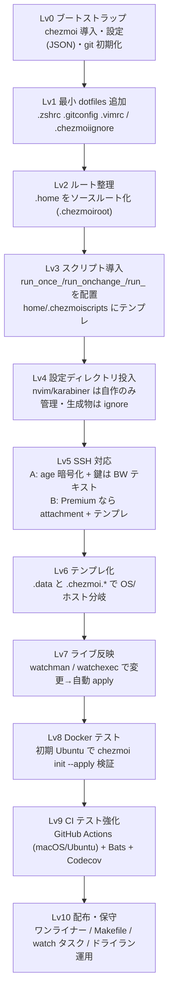

# dotfiles

## セットアップ手順（`chezmoi init --apply` 前）

### MacOS
```sh
export HOMEBREW_NO_INSTALL_FROM_API=1
/bin/bash -c "$(curl -fsSL https://raw.githubusercontent.com/Homebrew/install/HEAD/install.sh)"
brew install git chezmoi
```

### Ubuntu
```sh
sudo apt update && sudo apt install -y git
snap install chezmoi --classic
```

### Raspberry Pi OS
```sh
sudo apt update && sudo apt install -y git curl zsh
sh -c "$(curl -fsLS get.chezmoi.io)" -- -b "$HOME/.local/bin"
export PATH="$HOME/.local/bin:$PATH"
```

### Windows
```ps1
winget install --id Git.Git -e --source winget
winget install --id=twpayne.chezmoi  -e
```

## 初期化

```sh
chezmoi init --apply hibiki-kato
```

Raspberry Pi では `/etc/os-release` が `raspbian` を返すか、ホスト名に `raspberrypi` / `raspi` が含まれる場合に自動検出される。Ubuntu は GUI 環境の有無で `desktop` / `server` を自動判定し、`common` と該当プロファイルを実行する。

---

## dotfiles の更新ワークフロー

### ファイルを編集して反映する

```sh
# chezmoi ソースを直接編集
chezmoi edit ~/.zshrc

# 編集後に適用
chezmoi apply
```

または実ファイルを直接編集した後:

```sh
# 差分確認
chezmoi diff

# chezmoi ソースへ取り込み
chezmoi re-add ~/.zshrc

# git でコミット
cd ~/.local/share/chezmoi
git add -p
git commit -m "update zshrc"
git push
```

### 新しいファイルを管理対象に追加する

```sh
chezmoi add ~/.config/starship.toml
```

### リモートの変更を取り込む

```sh
chezmoi update        # git pull + apply を一括実行
```

または個別に:

```sh
cd ~/.local/share/chezmoi
git pull
chezmoi apply
```

### 差分・状態確認

```sh
chezmoi diff          # ソースと実ファイルの差分
chezmoi status        # 変更があるファイル一覧
chezmoi data          # テンプレ変数の確認
```

### ドライラン（適用前確認）

```sh
chezmoi apply --dry-run --verbose
```

---

## TODO

```mermaid
flowchart TD
  A0["Lv0 ブートストラップ chezmoi 導入・設定(JSON)・git 初期化"] --> A1
  A1["Lv1 最小 dotfiles 追加\n.zshrc .gitconfig .vimrc / .chezmoiignore"] --> A2
  A2["Lv2 ルート整理\n.home をソースルート化 (.chezmoiroot)"] --> A3

  A3["Lv3 スクリプト導入\nrun_once_/run_onchange_/run_ を配置\nhome/.chezmoiscripts にテンプレ"] --> A4
  A4["Lv4 設定ディレクトリ投入\nnvim/karabiner は自作のみ管理・生成物は ignore"] --> A5
  A5["Lv5 SSH 対応\nA: age 暗号化 + 鍵は BW テキスト\nB: Premium なら attachment + テンプレ"] --> A6
  A6["Lv6 テンプレ化\n.data と .chezmoi.* で OS/ホスト分岐"] --> A7
  A7["Lv7 ライブ反映\nwatchman / watchexec で変更→自動 apply"] --> A8
  A8["Lv8 Docker テスト\n初期 Ubuntu で chezmoi init --apply 検証"] --> A9
  A9["Lv9 CI テスト強化\nGitHub Actions (macOS/Ubuntu) + Bats + Codecov"] --> A10
  A10["Lv10 配布・保守\nワンライナー / Makefile / watch タスク / ドライラン運用"]
```
