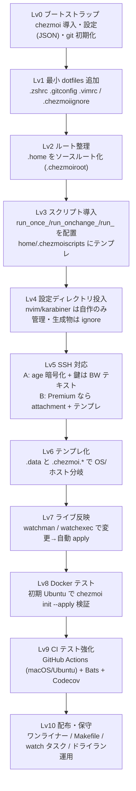

# dotfiles

## セットアップ手順（`chezmoi init --apply` 前）

### MacOS
```sh
export HOMEBREW_NO_INSTALL_FROM_API=1
/bin/bash -c "$(curl -fsSL https://raw.githubusercontent.com/Homebrew/install/HEAD/install.sh)"
brew install git chezmoi
```

### Ubuntu
```sh
sudo apt update && sudo apt install -y git
snap install chezmoi --classic
```

Ubuntu installers place user-level CLI tools under `$HOME/.local/bin`; `.zshrc` adds this directory to `PATH`.

### Raspberry Pi OS
```sh
sudo apt update && sudo apt install -y git curl zsh
sh -c "$(curl -fsLS get.chezmoi.io)" -- -b "$HOME/.local/bin"
export PATH="$HOME/.local/bin:$PATH"
```

### Windows
```ps1
winget install --id Git.Git -e --source winget
winget install --id=twpayne.chezmoi  -e
```

## 初期化

```sh
chezmoi init --apply hibiki-kato
```

Raspberry Pi OS では `/etc/os-release` が `raspbian` / Raspberry Pi 系を返す場合に `raspberrypi` profile が選ばれる。Raspberry Pi 上でも Ubuntu の場合は Ubuntu として扱い、GUI 環境の有無で `desktop` / `server` を自動判定して `common` と該当プロファイルを実行する。

## 手動インストール・初回設定チェックリスト

`chezmoi init --apply` は `install/` 配下のスクリプトで多くのソフトを導入する。手動インストールやログイン、ハードウェア固有の作業が残ったら、ここに追加する。

### Kubuntu / Wayland 移行時に確認

- [ ] Visual Studio Code: `install/ubuntu/desktop/07-vscode.sh` が Microsoft 公式 APT リポジトリから導入する。Settings Sync にサインインする。
- [ ] Sunshine: `install/ubuntu/desktop/14-sunshine.sh` が公式 Cloudsmith stable リポジトリから導入する。Wayland のキャプチャ権限と Moonlight 接続を確認する。
- [ ] OpenRGB: `install/ubuntu/desktop/11-openrgb.sh` が公式 Flatpak と公式 udev ルールを設定する。対応デバイスの検出と制御を確認する。
- [ ] Warp: `install/ubuntu/desktop/06-warp.sh` で導入。Wayland ネイティブ動作を設定し、描画・ホットキーを確認する。
- [ ] Espanso: `install/ubuntu/desktop/10-espanso.sh` で Wayland 用 DEB を導入。必要な capability を設定し、Wayland で展開を確認する。Wayland 対応は実験的。
- [ ] 日本語入力とキーボード: `install/ubuntu/desktop/04-input.sh` が Fcitx5-Mozc と Plasma 用設定モジュールを導入する。ログアウト/ログイン後、システム設定の「キーボード > 仮想キーボード」で Fcitx5 を選択し、Fcitx5 設定で Ctrl+Space を入力メソッドのオン/オフに割り当てる。Caps Lock→左 Ctrl は「システム設定 > キーボード > 詳細設定 > Ctrl の位置」で設定する。
- [ ] Dropbox: `install/ubuntu/desktop/03-dropbox.sh` が公式 DEB と Ubuntu の Ayatana AppIndicator 互換ライブラリを導入する。導入後にサインインし、トレイアイコンと同期を確認する。手動 symlink は作らない。
- [ ] Dolphin + Dropbox: Dolphin がある場合 `install/ubuntu/desktop/15-dolphin-plugins.sh` が `dolphin-plugins` を導入し、chezmoi の run-once script が既存の有効なプラグインを保持して Dropbox を有効にする。Dolphin を既に開いている場合は再起動する。設定は「設定 > Dolphin の設定 > コンテキストメニュー」で確認できる。同期状態アイコンと Dropbox 操作メニューには公式 Dropbox クライアントの起動が必要。

### 現在の環境にはあるが、自動インストールに含まれていないもの

必要なものだけ新環境へ入れ直す。Ubuntu/Kubuntu 標準のデスクトップ部品や依存パッケージは含めない。

- [ ] ChatGPT DEB: 現環境には `chatgpt` DEB がある。新環境では自動導入対象の ChatGPT Snap を使うか、DEB を別途導入するか選ぶ。
- [ ] `htop`、`nvtop`、`radeontop`、`yt-dlp`、`sshpass`、`vulkan-tools`: APT から手動導入。必要なものだけ選ぶ。
- [ ] `wolframscript` / Wolfram: Wolfram アカウント、ライセンス、インストーラーを用意して手動導入。
- [ ] Go と `whatscli`: Linuxbrew に入っているが、デスクトップ用 Homebrew リストにはない。必要なら `brew install go whatscli`。
- [ ] OpenClaw: npm グローバル導入。現行の chezmoi スクリプトには導入処理なし。
- [ ] GitHub Copilot CLI: Homebrew cask に入っているが、導入スクリプトには記載なし。
- [ ] Buzz: Snap で導入されているが、Snap のパッケージ一覧には記載なし。
- [ ] Espanso GUI: Flatpak で導入されているが、Flatpak の一覧には記載なし。
- [ ] `chaintools`: Cargo で導入されているが、Cargo installer には記載なし。
- [ ] Haruna、Elisa、NeoChat、Konversation、Kmahjongg、Kmines、Kpat、Ksudoku、KRDC、Skanlite、Skanpage: 現環境にはあるが、アプリ導入スクリプトには記載なし。Kubuntu 標準で入るものは重複導入しない。
- [ ] `mpv`: server プロファイルの導入スクリプトにはあるが、desktop プロファイルでは実行されない。
- [ ] `chawan`、`meli`: Homebrew の server プロファイルにあるが、desktop では実行されない。必要なら server スクリプトを明示的に実行するか、desktop 用一覧へ移す。
- [ ] 研究用 Python CLI (`nf-core`、`refgenie` / `import_igenome`、`pipestat` / `phc`、`repo2rocrate` / `rocrate`、`faidx`): 現環境の `~/.local/bin` に実行コマンドが存在する。Nextflow の各プロセスはモジュールごとの Conda YAML またはコンテナで実行されるが、これらのCLI自体は現在の `~/DNA` の環境定義・ソース内では確認できず、ユーザー環境の Python に別途インストールされている。手動利用や未コミットの研究手順で使う可能性があるため、移行前に用途を確認する。chezmoi で一括導入しない。
- [ ] LibreOffice: 現環境にはある。Kubuntu のインストール内容を確認し、不足分だけ追加する。
- [ ] KDE Connect、プリンター、Bluetooth 周辺: 必要な機器と用途を新環境で確認する。プリンター用スクリプトは `install/ubuntu/server/printer.sh` にあり、desktop 自動実行には含まれない。
- [ ] LACT 初回起動: Flatpak は自動導入する。GPU 制御を使う場合は初回起動時に `lactd` system daemon のセットアップを許可し、動作を確認する。

KDE の設定を Kubuntu へ引き継ぐ手順は [KDE.md](KDE.md) を参照。KDE ではモニターの色温度に KWin Night Color を使うため、Redshift は導入しない。

### 既存スクリプトで自動導入される主なソフト

- APT: C/C++/LLVM/OpenMPI 開発環境、zsh と基本 CLI、rclone、CopyQ、VLC、Flameshot、Stacer、GParted、Graphviz、Fcitx5-Mozc、TeX Live。Dolphin がある場合は `dolphin-plugins` も導入。
- Snap: Brave、Zotero、ChatGPT、Bitwarden と CLI、Surfshark、Steam、Discord、Docker、Spotify、Mission Center、GIMP、OBS、Zoom、Thunderbird、DropboxIgnore、LocalSend、Slack、Draw.io、Neovim、Yazi、uv。
- Flatpak: RustDesk、Hidamari、OpenRGB、LACT。
- Linuxbrew: atuin、starship、glow、lazygit、tree-sitter-cli、gh、Gemini CLI、zsh 補助プラグイン、Antigravity CLI。
- 個別 installer: Dropbox、VS Code、Warp、Espanso Wayland 版、Sunshine stable、Claude Code、Codex、Miniforge、Juliaup、Rust、Ollama、Nextflow、Tailscale。NVIDIA driver/CUDA は NVIDIA GPU が検出された場合に driver profile が導入する。

Docker は `install/ubuntu/desktop/00-snap.sh` の `docker` Snap で導入する。Docker 公式 APT リポジトリ版ではない。GitHub CLI と Gemini CLI は Linuxbrew、GParted は APT、Thunderbird は Snap、LACT は Flatpak で導入する。

旧環境の Cinnamon、GNOME Tweaks、X11 セッション用ツールは Kubuntu へそのまま移さない。`install/ubuntu/desktop/05-desktop.sh` は Plasma 検出時に Cinnamon/Xorg を追加しないようにしてある。

### 追加する項目

新しいマシンで手作業が必要だったソフトや設定を、以下の形式で追記する。

- [ ] ソフト名: インストール方法、サインインや初回設定、確認事項

---

## dotfiles の更新ワークフロー

### ファイルを編集して反映する

```sh
# chezmoi ソースを直接編集
chezmoi edit ~/.zshrc

# 編集後に適用
chezmoi apply
```

または実ファイルを直接編集した後:

```sh
# 差分確認
chezmoi diff

# chezmoi ソースへ取り込み
chezmoi re-add ~/.zshrc

# git でコミット
cd ~/.local/share/chezmoi
git add -p
git commit -m "update zshrc"
git push
```

### 新しいファイルを管理対象に追加する

```sh
chezmoi add ~/.config/starship.toml
```

### リモートの変更を取り込む

```sh
chezmoi update        # git pull + apply を一括実行
```

または個別に:

```sh
cd ~/.local/share/chezmoi
git pull
chezmoi apply
```

### 差分・状態確認

```sh
chezmoi diff          # ソースと実ファイルの差分
chezmoi status        # 変更があるファイル一覧
chezmoi data          # テンプレ変数の確認
```

### ドライラン（適用前確認）

```sh
chezmoi apply --dry-run --verbose
```

---

## TODO

```mermaid
flowchart TD
  A0["Lv0 ブートストラップ chezmoi 導入・設定(JSON)・git 初期化"] --> A1
  A1["Lv1 最小 dotfiles 追加\n.zshrc .gitconfig .vimrc / .chezmoiignore"] --> A2
  A2["Lv2 ルート整理\n.home をソースルート化 (.chezmoiroot)"] --> A3

  A3["Lv3 スクリプト導入\nrun_once_/run_onchange_/run_ を配置\nhome/.chezmoiscripts にテンプレ"] --> A4
  A4["Lv4 設定ディレクトリ投入\nnvim/karabiner は自作のみ管理・生成物は ignore"] --> A5
  A5["Lv5 SSH 対応\nA: age 暗号化 + 鍵は BW テキスト\nB: Premium なら attachment + テンプレ"] --> A6
  A6["Lv6 テンプレ化\n.data と .chezmoi.* で OS/ホスト分岐"] --> A7
  A7["Lv7 ライブ反映\nwatchman / watchexec で変更→自動 apply"] --> A8
  A8["Lv8 Docker テスト\n初期 Ubuntu で chezmoi init --apply 検証"] --> A9
  A9["Lv9 CI テスト強化\nGitHub Actions (macOS/Ubuntu) + Bats + Codecov"] --> A10
  A10["Lv10 配布・保守\nワンライナー / Makefile / watch タスク / ドライラン運用"]
```
